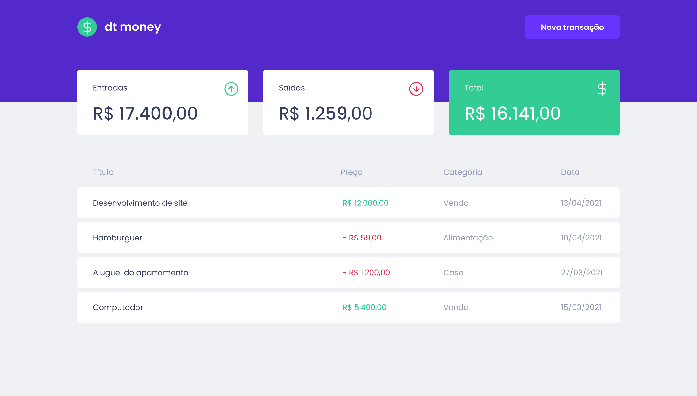
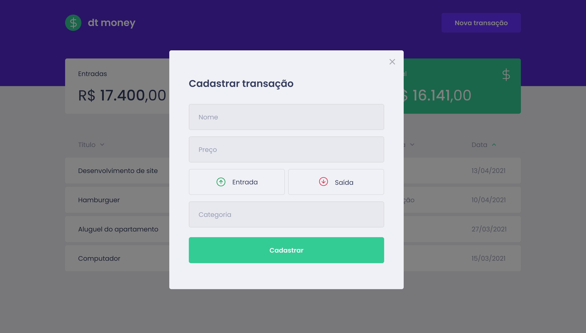

# dt money





> This application allows the user to input transactions and calculate total the income, outcome and the difference between them. Design by @tiagoluchten. Project part of trilha react 2021.

# 💻 Technologies
Technologies used in this project:

- [React](https://reactjs.org/)
- [TypeScript](https://www.typescriptlang.org/)
- [Styled Components](https://styled-components.com/)
- [MirageJS](https://miragejs.com/)
- [Axios](https://github.com/axios/axios)
- [Polished](https://polished.js.org/)

# 👷 How to run

* Install the lastest versions of Yarn and Node.js


```bash
# Open the terminal and clone this repository with the command:
git clone https://github.com/gabrielb-ss/dtmoney.git

# Enter the new directory created after cloning
cd dtmoney

# Install the dependecies (it will take a while...)
yarn install

# Run the application
yarn start
```

* After a while, a new tab should open in your default browser showing the application running

## 🤝 Collaborators
<table>
  <tr>
    <td align="center">
      <a href="#">
        <br>
        <sub>
          <b>Gabriel Barbosa</b>
        </sub>
      </a>
    </td>
  </tr>
</table>


## 📝 License

This project is under license. See [LICENSE](LICENSE.md) for more details.

[⬆ Go back to the top](#dtmoney)<br>